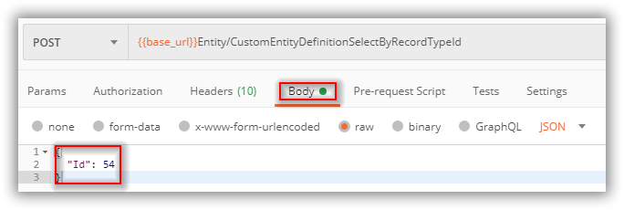
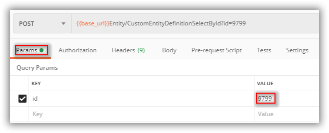

# Working with Custom Forms Using the Entity APIs

This document describes how to use the Entity series of APIs to work with Custom Forms.

## Importing the Postman collection

The collection in the repo is called `Vivantio Custom Form.postman_collection.json`. Note that the collection is set to use **Basic Auth** with the **Username** and **Password** being populated from variables set in the Vivantio environment. The collection is populated with three Postman tests:

```JavaScript
pm.test("Status code is 200", function () {
    pm.response.to.have.status(200);
});

pm.test("Successful status is true", function () {
    pm.expect(pm.response.json().Successful).to.equal(true);
});

pm.test("No error messages returned", function () {
    pm.expect(pm.response.json().ErrorMessages.length).to.equal(0);
});
```

These tests should be passing green for a successful API call.

## Core Concepts

To work successfully with Custom Forms it's important to distinguish between the following:

- Custom Form *Definitions*: these are the definitions of custom forms that are created for use with a specific ticket type.
- Custom Form *Instances*: these are instances of where a custom form has been used by a ticket item and custom form data is associated with that tocket item.

## Get All Ticket Types

To begin working with custom form definitions you need to determine which ticket type ID (as an integer) you want to work with. The **Get All Ticket Types** request calls [POST api/Configuration/TicketTypeSelectAll](https://webservices-na01.vivantio.com/Help/Api/POST-api-Configuration-TicketTypeSelectAll) which needs no further input to return the details of all the ticket types in your system.

## Get Custom Form Definition Master Details For Ticket Type ID

Having determined which ticket type ID you want to work with you need to pass this in to **Get Custom Form Definition Master Details For Ticket Type ID** which calls [POST api/Entity/CustomEntityDefinitionSelectByRecordTypeId](https://webservices-na01.vivantio.com/Help/Api/POST-api-Entity-CustomEntityDefinitionSelectByRecordTypeId). Note that this API requires the ticket type ID to be passed in via the request body:



The results of this API will include the high-level details of all the custom forms associated with the passed in ticket type ID. Each custom form has an ID which can be used to get lower-level details about the form.

## Get Custom Form Definition Child Details For Master ID

Use **Get Custom Form Definition Child Details For Master ID** to get further details about a custom form. This request calls [POST api/Entity/CustomEntityDefinitionSelectById/{id}](https://webservices-na01.vivantio.com/Help/Api/POST-api-Entity-CustomEntityDefinitionSelectById-id) using the ID of a custom form from the previous request. This value can be passed in either via **Query Params** or **Path Variables** (Query Params is illustrated):



The results of this API include the **Field Definitions** for the custom form.

## Get Custom Field Definition For Definition ID

To retrieve the details of a specific Field Definition 