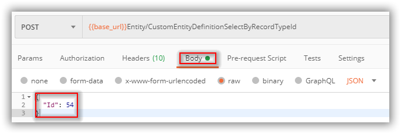

# Working with Ticket APIs

This document describes how to use the Ticket APIs.

## Importing the Postman collection

Please see [here](importing-a-postman-collection.md) for the generic details about importing a postman collection. The specific file to import for this tutorial is [Vivantio Tickets.postman_collection.json](https://github.com/Vivantio/apitutorials/blob/master/Vivantio%20Tickets.postman_collection.json).

## Core Concepts

- Provides different WebApI methods to retrieve data in relating to Tickets/Incidents.

## Get Single Ticket By Id

To begin working with this API method you need to determine which ticket type ID (as an integer) you want to work with. The **Get Single Ticket By Id** request calls [POST api/Configuration/SelectById/{id}](https://webservices-na01.vivantio.com/Help/Api/POST-api-Ticket-SelectById-id) using the ID of a custom form from the previous request. This value can be passed in either via **Query Params** or **Path Variables** .


## Get All Users

The **Get All Users** request calls [POST api/Configuration/UserSelectAll](https://webservices-na01.vivantio.com/Help/Api/POST-api-Configuration-UserSelectAll) which needs no further input to return the details of all the ticket types in your system.

## Get All the Actions for a specified Ticket

This request calls [POST api/Ticket/ActionSelectByParentId/{id}?includePrivate={includePrivate}&includeAttachments={includeAttachments}](https://webservices-na01.vivantio.com/Help/Api/POST-api-Ticket-ActionSelectByParentId-id_includePrivate_includeAttachments) using the ID from the previous request. This value can be passed in either via **Query Params** or **Path Variables** (Query Params is illustrated):



## Get Child Ticket By Id

The **Child Ticket** for a Parent Ticket can be retrieved using **Get Child Ticket By Id** which calls [POST api/Configuration/TicketTypeSelectByChildTicketTypeId/{id}](https://webservices-na01.vivantio.com/Help/Api/POST-api-Configuration-TicketTypeSelectByChildTicketTypeId-id) using a field definition ID from the previous request. This value must be passed in as a **Path Variables** value:


## Get Parent Ticket By Id

The **Parent Ticket** for a child Ticket can be retrieved using **Get parent Ticket By Id** which calls [POST api/Configuration/SelectParentTicketsByTicketId/{id}](https://webservices-na01.vivantio.com/Help/Api/POST-api-Ticket-SelectParentTicketsByTicketId-id) using a field definition ID from the previous request.

```JSON
{
  "Id": 655984,
}
```

The results of this API will returns the parent ticket of the child Item.

## Get available workflow decisions

The **Workflow decisions** for a Ticket can be retrieved using **Get available workflow decisions By Id** which calls [POST api/Configuration/WorkflowDecisionOptionSelectByWorkflowStepId](https://webservices-na01.vivantio.com/Help/Api/POST-api-Ticket-WorkflowDecisionOptionSelectByWorkflowStepId) using a field definition ID from the previous request.

 Note that this API requires the ticket type ID to be passed in via the request body:


The results of this API will returns the workflow decisions of that ticket.

## Get List of Tickets with matching ID's

 **List of Tickets** can be retrieved using **Get List of Tickets matching ID's** which calls [POST api/Ticket/SelectList](https://webservices-na01.vivantio.com/Help/Api/POST-api-Ticket-SelectList) using a field definition ID's from the previous requests.

```JSON
[
  10404,
  10402,
  10225  
]
```

The results of this API will returns all the ticket details that sent in the Json body.

## Get SLA Information for the ticket

 **SLA Information** can be retrieved using **Get SLA Information for the ticket** which calls [POST api/Ticket/SLAStageInstanceSelectByTicket/{id}](https://webservices-na01.vivantio.com/Help/Api/POST-api-Ticket-SLAStageInstanceSelectByTicket-id) using a field definition ID's from the previous requests.

The results of this API will returns the SLA information for that particular Ticket.
